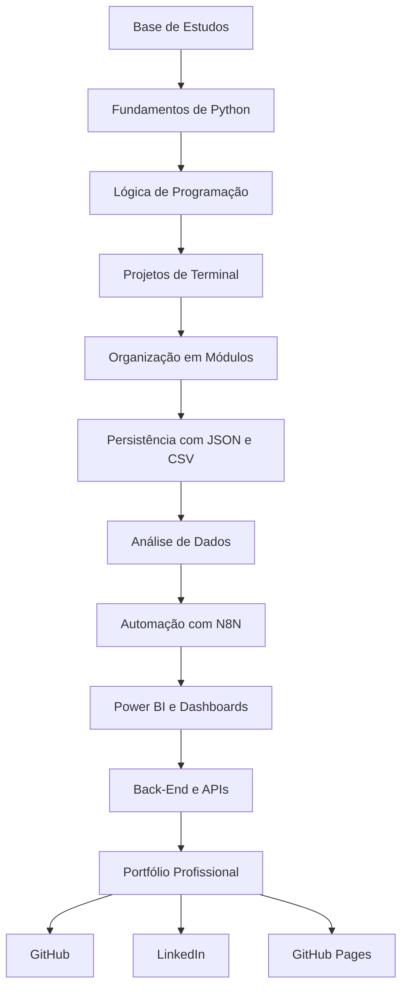
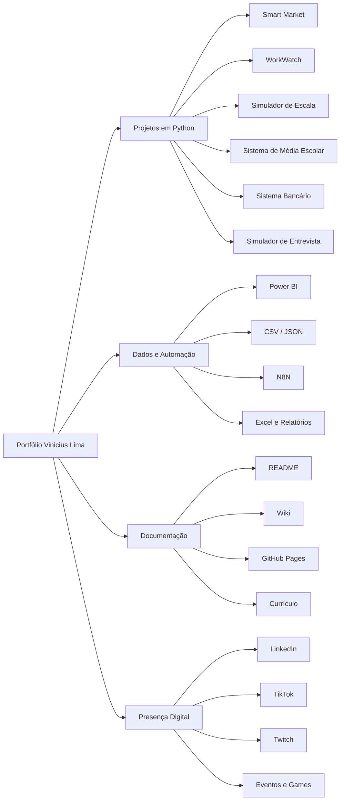
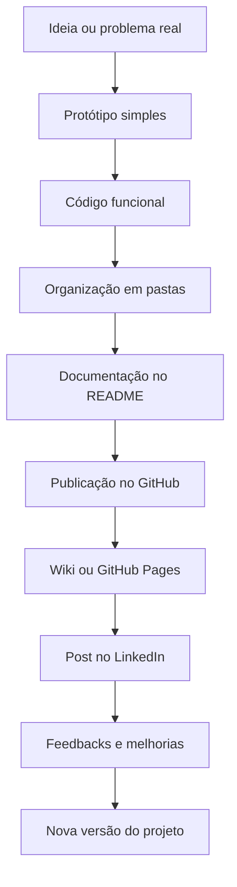
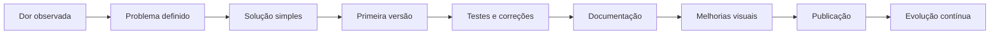
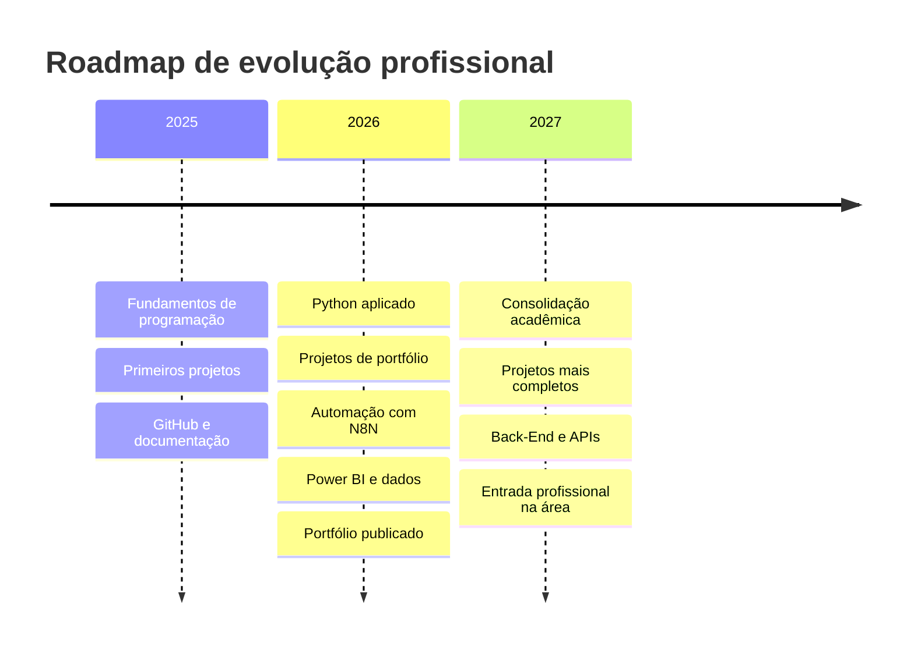

<h1 align="center">Olá, eu sou Vinicius Lima 👋</h1>

  <strong>Estudante de Análise de Dados e Desenvolvimento de Sistemas</strong>

  

  
  
  
  

  
  
  

---

## 🚀 Sobre mim

Sou estudante de **Análise de Dados e Desenvolvimento de Sistemas**, atualmente no **3º semestre**, com previsão de formação em **2027**.

Estou construindo minha trajetória na tecnologia com foco em **projetos práticos**, documentação profissional e evolução contínua no GitHub. Minha estratégia é transformar estudos em entregas visíveis: sistemas simples, úteis, organizados e com potencial de crescimento.

Hoje meu foco está em:

- 🐍 **Python** para lógica, automação e desenvolvimento de sistemas;
- 📊 **Dados** com CSV, JSON, Excel, SQL e Power BI;
- ⚙️ **Automação** com N8N e fluxos de processo;
- 🧱 **Back-End** e estruturação de aplicações;
- 📝 **Documentação** com README, Wiki e apresentação profissional;
- 🌐 **Portfólio** com projetos reais publicados e organizados.

---

## 🎯 Direção profissional

Busco oportunidades para iniciar e crescer na área de tecnologia, principalmente em posições como:

| Área | Interesse |
|---|---|
| 🧑‍💻 Desenvolvimento | Estágio em Desenvolvimento / Back-End Júnior |
| 📊 Dados | Estágio em Dados / Power BI / Análise de Dados |
| ⚙️ Automação | Processos, relatórios, integrações e produtividade |
| 🧠 Projetos | Soluções reais, documentação e evolução de produto |

> Meu objetivo é construir uma base sólida, mostrar evolução real e transformar aprendizado em projetos que possam ser avaliados por outras pessoas.

---

## 🧠 Stack e áreas de estudo

### Linguagens e desenvolvimento

  

  

### Dados, BI e automação

  

---

## 🧭 Mapa da minha evolução

---

## 🏗️ Organograma do portfólio

---

## 📚 Formação e estudos

### 🎓 Formação acadêmica

- **Análise de Dados e Desenvolvimento de Sistemas**
- Atualmente no **3º semestre**
- Previsão de formação: **2027**

### 📜 Certificações e estudos complementares

- **Python Fundamentals**
- **Bootcamp Santander 2025 - Back-End com Python | DIO**
- **Bootcamp Santander 2025 - Automação com N8N | DIO**
- **Certificação Intermediária - Programador Júnior | FASUL**
- **Santander - Excel com Inteligência Artificial | DIO**
- **Basic Excel Extension Course**
- **Basic English Extension Course**
- **Fundamentos de IA Generativa com Bedrock | DIO**
- **Machine Learning, MySQL, Power BI e Python Backend**

---

## 🌟 Projetos em destaque

<table>
  <tr>
    <td width="50%" valign="top">
      <h3 align="center">🛒 Smart Market</h3>
      

        Sistema em Python para controle de compras de mercado, histórico de preços,
        comparação entre compras e análise de gastos.
      

      

        <strong>Dor resolvida:</strong> dificuldade em acompanhar gastos, preços e variações entre compras.
      

      

        <strong>Como resolve:</strong> registra compras, salva histórico, compara preços e identifica mudanças de consumo.
      

      

        <strong>Status:</strong> Em desenvolvimento
      

      

        
      

    </td>
    <td width="50%" valign="top">
      <h3 align="center">🖥️ WorkWatch</h3>
      

        Ferramenta local para monitoramento de produtividade no computador,
        registrando janelas ativas e atividades em arquivos CSV.
      

      

        <strong>Dor resolvida:</strong> falta de visibilidade sobre como o tempo é usado no computador.
      

      

        <strong>Como resolve:</strong> captura dados de uso, registra logs e prepara base para relatórios.
      

      

        <strong>Status:</strong> Em desenvolvimento
      

      

        
      

    </td>
  </tr>

  <tr>
    <td width="50%" valign="top">
      <h3 align="center">🎓 Sistema de Média Escolar</h3>
      

        Projeto para cálculo de média escolar, criado para reforçar fundamentos
        de lógica, entrada de dados, condições e publicação em página web.
      

      

        <strong>Dor resolvida:</strong> transformar um exercício simples em projeto apresentável.
      

      

        <strong>Como resolve:</strong> aplica lógica de média, exibe resultado e mostra evolução em uma versão web.
      

      

        <strong>Status:</strong> Demo publicada
      

      

        
        
      

    </td>
    <td width="50%" valign="top">
      <h3 align="center">📅 Simulador de Escala de Trabalho</h3>
      

        Sistema em Python para calcular dias de trabalho e folga com base em
        escalas configuráveis, como 6x3.
      

      

        <strong>Dor resolvida:</strong> dificuldade em prever folgas e dias trabalhados em escalas rotativas.
      

      

        <strong>Como resolve:</strong> calcula automaticamente o status de uma data e os próximos dias da escala.
      

      

        <strong>Status:</strong> Em desenvolvimento
      

      

        
      

    </td>
  </tr>
</table>

---

## 🧩 Outros projetos

<table>
  <tr>
    <td width="50%" valign="top">
      <h3 align="center">🏦 Sistema Bancário DIO</h3>
      

        Desafio prático em Python simulando operações bancárias como depósito,
        saque, extrato e controle de regras.
      

      

        <strong>Aprendizado:</strong> lógica, funções, validações e regras de negócio.
      

      

        
      

    </td>
    <td width="50%" valign="top">
      <h3 align="center">💼 Simulador de Entrevista</h3>
      

        Sistema em Python para simular uma entrevista de emprego, coletar respostas
        e organizar uma avaliação final do candidato.
      

      

        <strong>Aprendizado:</strong> fluxo lógico, validação de entrada, análise textual e organização de código.
      

      

        
      

    </td>
  </tr>
</table>

---

## 📊 Evolução atual

| Área | Nível atual | Direção |
|---|---|---|
| 🐍 Python | █████████░░░ | Lógica, automação, projetos e back-end |
| 📊 Dados | ████████░░░░ | CSV, JSON, Excel, SQL e análise |
| 🟡 Power BI | ███████░░░░░ | Dashboards, relatórios e visualização |
| ⚙️ N8N | ███████░░░░░ | Automações, integrações e fluxos |
| 🧱 Back-End | ███████░░░░░ | APIs, modularização e estrutura |
| 🗄️ SQL | ██████░░░░░░ | Consultas, modelagem e organização |
| 📝 Documentação | █████████░░░ | README, Wiki, currículo e portfólio |
| 🌐 Git/GitHub | ████████░░░░ | Versionamento, publicação e apresentação |

---

## 📌 Fluxo de evolução dos projetos

---

## 🧪 Como penso meus projetos

---

## 🧠 Minha forma de aprender

Acredito em evolução prática e construção contínua.

Minha rotina de estudos envolve:

- estudar conceitos;
- praticar com exercícios;
- criar pequenos projetos;
- documentar aprendizados;
- melhorar versões anteriores;
- subir projetos no GitHub;
- transformar dificuldades em aprendizado real;
- publicar minha evolução de forma profissional.

Tenho focado principalmente em **Python**, **dados**, **automação**, **Power BI**, **SQL**, **documentação** e construção de projetos que demonstrem minha evolução profissional.

---

## 📊 Estatísticas do GitHub

  
  

  

  

---

## 📉 Gráfico de atividade

  

---

## 🗺️ Roadmap

---

## 💼 O que você vai encontrar aqui

No meu GitHub, você encontrará projetos voltados para:

- prática de **Python**;
- desenvolvimento **Back-End**;
- estudos de **Dados**;
- automações com **N8N**;
- dashboards e análises com **Power BI**;
- projetos de aprendizado com documentação;
- evolução progressiva como desenvolvedor;
- organização de portfólio para carreira.

Meu objetivo não é apenas criar repositórios, mas construir uma trajetória clara, organizada e visível de crescimento técnico.

---

## 🛠️ Próximos passos

- Melhorar a documentação dos projetos existentes;
- Criar versões mais completas dos projetos em Python;
- Evoluir projetos de terminal para interfaces mais amigáveis;
- Criar dashboards para análise de dados;
- Aplicar automações reais com N8N;
- Melhorar a organização dos repositórios;
- Publicar projetos com README e Wiki mais profissionais;
- Evoluir o portfólio pessoal publicado no GitHub Pages;
- Criar demonstrações visuais dos projetos.

---

## 📫 Contato

  
  
  
  

## 🐍 Minha atividade no GitHub

  <picture>
    <source media="(prefers-color-scheme: dark)" srcset="https://raw.githubusercontent.com/Dinox75/Dinox75/output/github-contribution-grid-snake-dark.svg">
    <source media="(prefers-color-scheme: light)" srcset="https://raw.githubusercontent.com/Dinox75/Dinox75/output/github-contribution-grid-snake.svg">
    
  </picture>

  <strong>Aprendizado constante, projetos reais e melhoria contínua.</strong>

